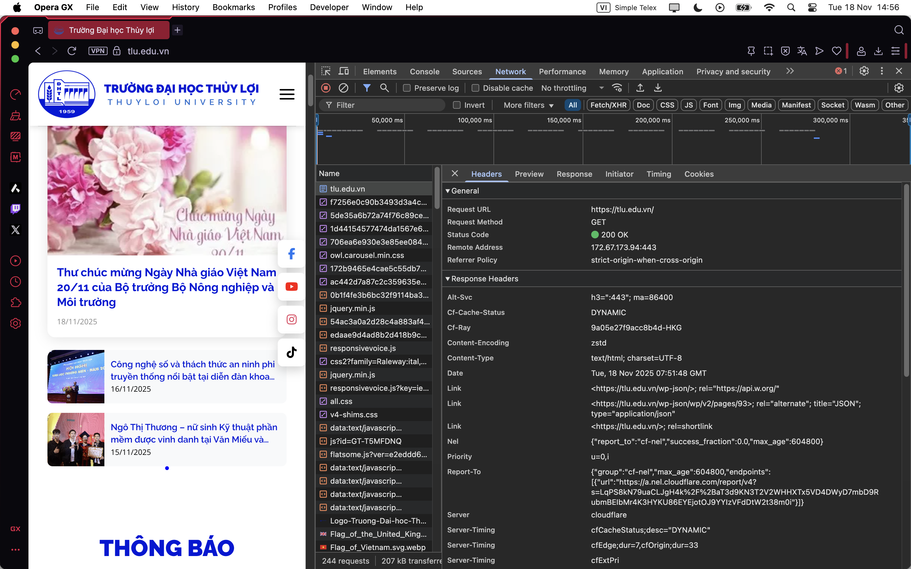

1. Ảnh chụp màn hình kết quả.  
  

2. Thông tin trích xuất  
    - Request URL:https://tlu.edu.vn/.  
    - Request Method: GET.  
    - Status code: 200 OK.  
3. Câu hỏi Phản biện : Vì sao request document tlu.edu.vn thì không thấy dùng cache bao giờ, còn CSS/JS thì lại được lấy từ memory hoặc disk cache?