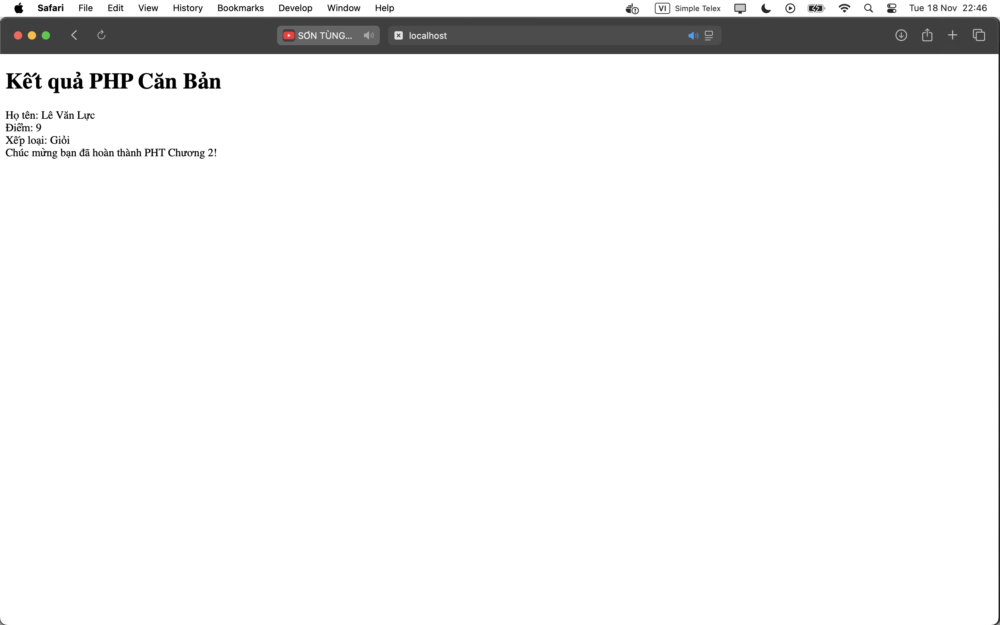

Chapter 2.  
1. Code đã hoàn thiện.  
[Chapter2.php](./Chapter2.php)  
2. Ảnh chụp màn hình kết quả.   
   
3. Câu hỏi phản biện: Khi PHP xử lý code trong tệp PHP thì nó có có đọc cả phần html không ạ? Nếu có thì những dự án lớn có ảnh hưởng gì khi phải code bằng 2 ngôn ngữ không ạ?