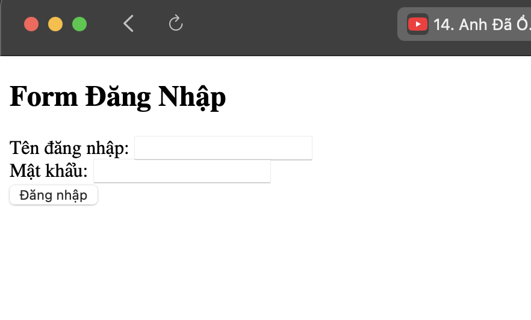
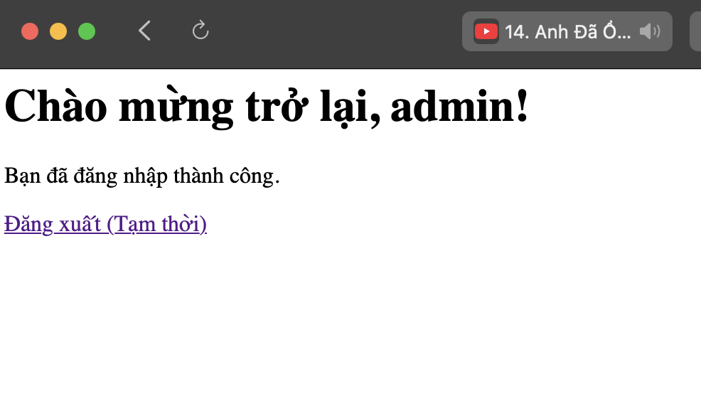

1. Code đã hoàn thiện.  
[handle_login.php](./code//handle_login.php)  
[welcome.php](./code/welcome.php)  

2. Ảnh chụp màn hình kết quả.   
  
  

3. Câu hỏi phản biện: Khi người dùng truy cập trực tiếp vào welcome.php mà không thông qua đăng nhập, trang phải xử lý thế nào?