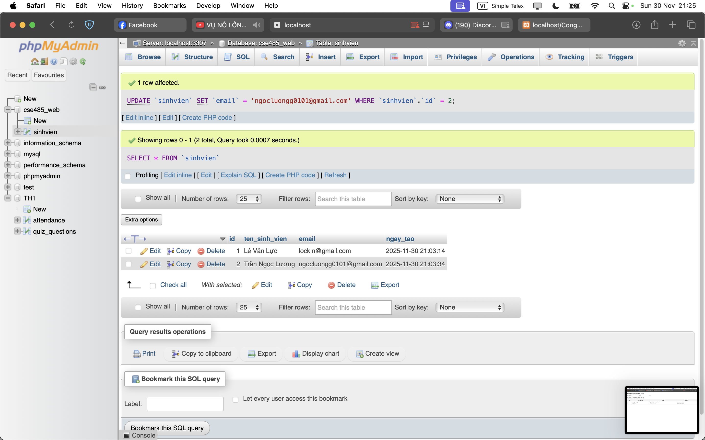
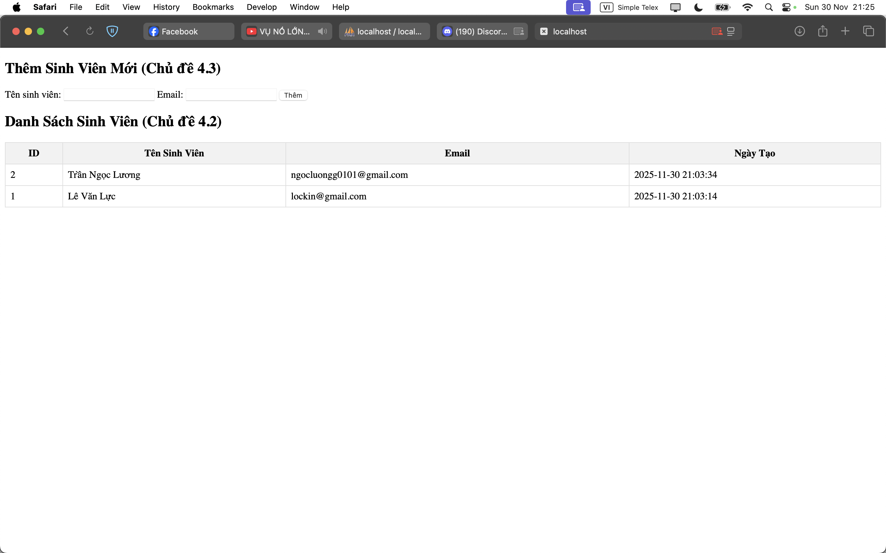

1. Code đã hoàn thiện.  
[chapter4.php](./chapter4.php)  

2. Ảnh chụp màn hình kết quả.   
  
  

3. Câu hỏi phản biện: Tại sao khi thêm dữ liệu vào CSDL bằng PDO, việc sử dụng Prepared Statement với $stmt->execute([$ten, $email]) lại an toàn hơn so với cách nối chuỗi trực tiếp vào câu lệnh SQL?