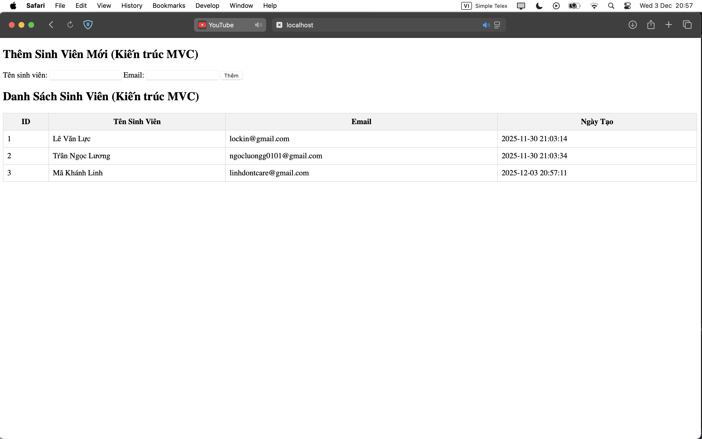

1. Code đã hoàn thiện.  
[index.php](./index.php)  
[models/SinhVienModel.php](./models.php)  
[views/sinhvien_view.php](./view.php)  

2. Ảnh chụp màn hình kết quả.   
  

3. Câu hỏi phản biện: Trong mô hình MVC, nếu chúng ta cho phép View viết trực tiếp code kết nối PDO và truy vấn SELECT * FROM sinhvien thì về sau có gặp vấn đề gì k ạ?