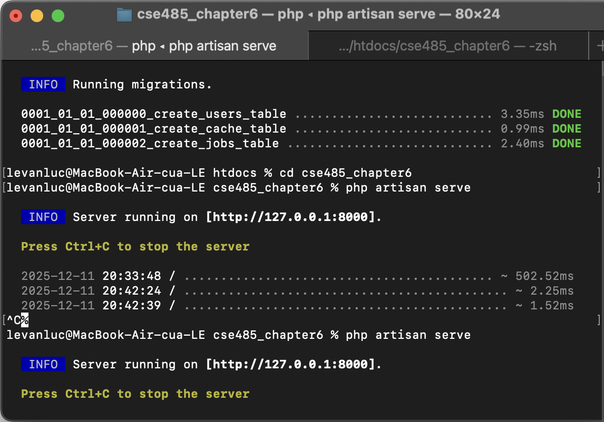
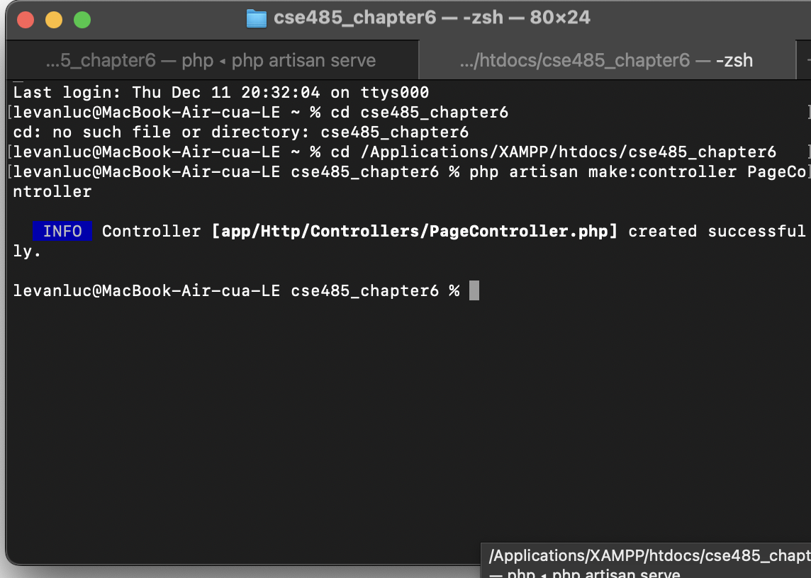
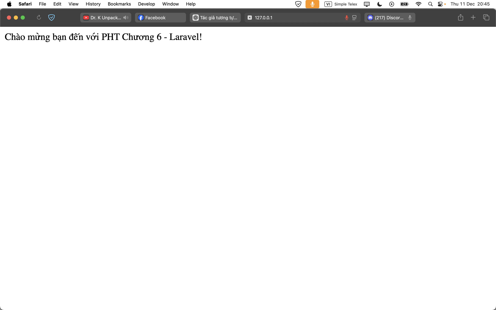

1. Code đã hoàn thiện.  
[PageController.php](./PageController.php)  
[web.php](./web.php)  

2. Ảnh chụp màn hình kết quả.   
  
  
  

3. Câu hỏi phản biện: Tại sao Controller trong Laravel phải ‘return’ dữ liệu thay vì dùng echo như PHP thuần? Việc bắt buộc dùng return giúp Laravel xử lý luồng Request → Response tốt hơn ở điểm nào?